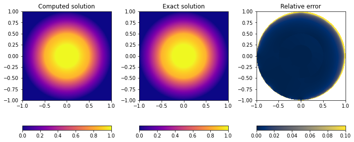
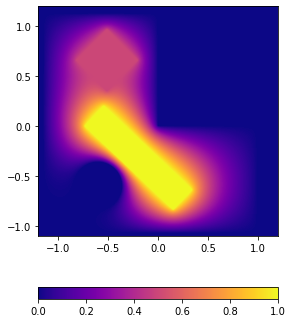

# PoissonFD

    

A simple, standalone implementation of a finite difference scheme [1] to solve the Poisson equation $\nabla (\varepsilon \nabla V) = 0$ with Dirichlet boundary conditions in a polygonal or circular domain. 
Multiple circular or polygonal boundaries (conductors) can be set with different boundary values, as well as multiple regions with different permittivities $\varepsilon$ (dielectrics).

The circles and polygons are projected on the Cartesian grid. 

Some test cases are presented in main.cpp, which can be built using make.

    

[1] Nagel, J. R. (2011). Solving the generalized poisson equation using the finite-difference method (FDM). Lecture Notes, Dept. of Electrical and Computer Engineering, University of Utah, 52.